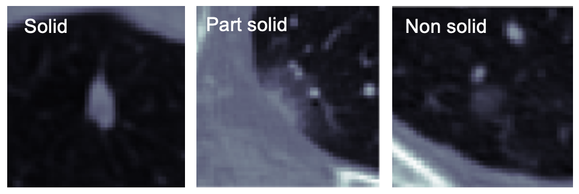
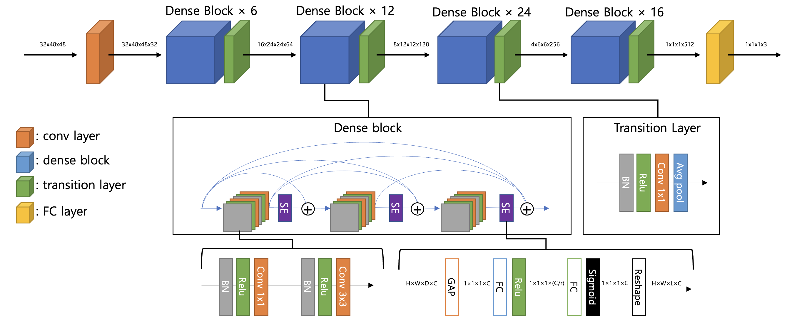

---

layout: page

title: Nodule Type classification for Lung CT

description: Lung nodule type classification model for Lung CT 3D image

img: assets/img/type_cls_01.png

importance: 1

category: work

---

## Project Outline

Lung CT 영상내에서 Nodule의 악성도를 판별하는 기준중의 하나인 Nodule Type(solid / part-solid / non-solid) 를 분류하는 딥러닝 모델 개발

## Role in Project

1. CNN을 base로 하는 Classification model 구현 및 실험
2. 성능 측정 및 검증

## Language & Framework

1. Language: Python
2. Framework: Tensorflow

## Approach

1. DenseNet-121-BC를 기반으로 하여 3D classification model을 구현

2. Squeeze & Excitation attention model을 적용하여 성능을 향상시킴

3. 여러개의 모델을 Training하여 Ensemble 기법을 활용하여 약간의 성능향상

   

## Achievement

성능평가 후 CAD(Computer aided detection) system에 integration 됨

|             | Solid | Part solid | Non solid |
| ----------- | ---------- | ---------- | ---------- |
| Sensitivity | 94.3% | 79.2       | 64.5%     |
| Specificity | 89.1% | 93.8%      | 94.2%     |
| Accuracy    | 92.5% | 91.6%      | 88.4%     |

